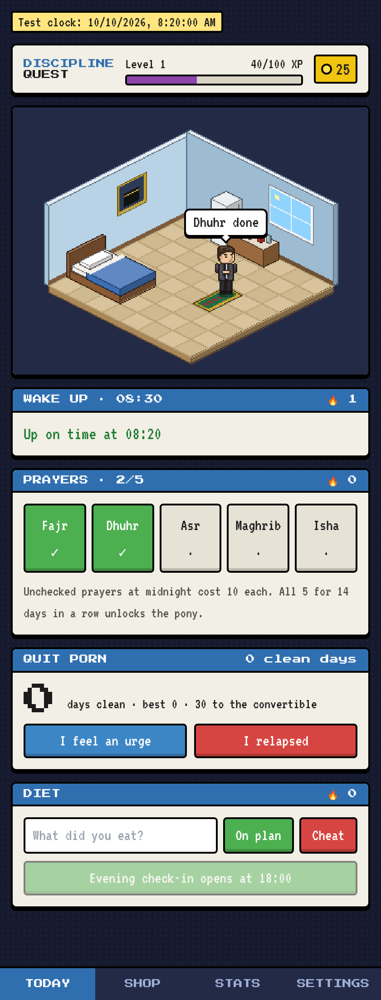

# Discipline Quest

A Habbo-style pixel room that reflects how disciplined you are. Your avatar walks to the prayer rug, the bed, or the kitchen counter when you check things off. Stay consistent and the room fills with furniture, a red convertible and a pony. Slip and it goes dark and messy.



## What it tracks

| Habit | How it works (strict mode) |
| --- | --- |
| 5 daily prayers | Check each one off. +5 coins each, +10 bonus for all five. Each unchecked prayer at midnight costs 10. |
| Wake up at 08:30 | Tap **I'm up** by 08:45 for +15. Late or no check-in costs 20 and resets the streak. |
| Quit porn | Days-clean counter. **I feel an urge** opens a 60-second urge-surfing screen (+5, up to 5×/day). **I relapsed** costs 100, resets the streak, locks your newest item for 7 clean days and makes the room gloomy. |
| Diet | Log meals as on-plan or cheat. Evening check-in (opens 18:00) gives +15. A cheat meal or no check-in costs 20. |
| Custom habits | Add your own daily habits in Settings. +5 when done, −5 when missed. |

- Days you don't open the app still count as full misses.
- Coins can go negative. While in debt the shop is closed.
- **Pony**: all 5 prayers for 14 days in a row. **Red convertible**: 30 clean days.

## Tech

Next.js 14 · TypeScript · Tailwind · Zustand (persisted to localStorage) · `@ducanh2912/next-pwa`.

There are no image assets. The avatar, pony, furniture and room are all drawn in code:

- `src/game/sprites/avatar.ts` – the avatar, drawn as pixel grids (colors in `palette.ts`)
- `src/game/iso.ts` – pixel-exact isometric box rasterizer
- `src/game/furniture.ts` – every piece of furniture, the room and the layout
- `src/engine/` – pure game rules and tests (`engine.test.ts`)

## Run

```bash
npm install
npm run dev               # http://localhost:3000
npm test                  # engine tests
npm run build             # production build + service worker
npm run preview-sprites   # renders sprite sheets to .preview/
npm run icons             # regenerates PWA icons from the avatar
```

**Testing time-based rules:** add `?now=2026-10-11T08:20` to the URL to pin the app clock for that tab. `?now=reset` clears it.

## Install on your phone

Deploy (e.g. `vercel` from this folder), open the URL on your phone, then use Share → Add to Home Screen (iOS) or Install app (Android). Data is stored only on that device, so use **Settings → Copy backup** and keep it somewhere safe.
